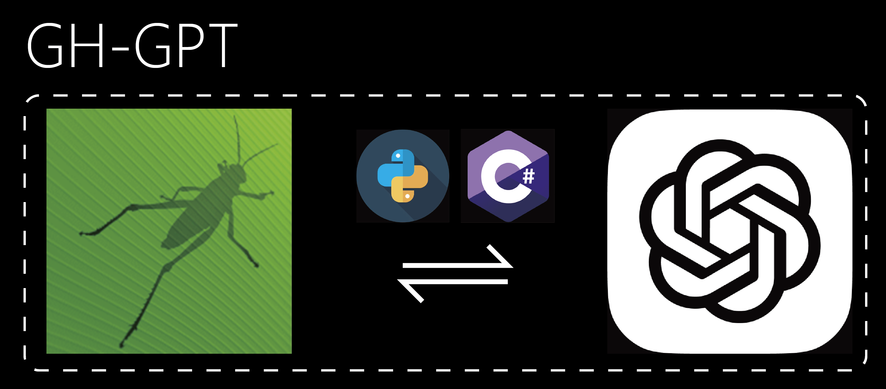
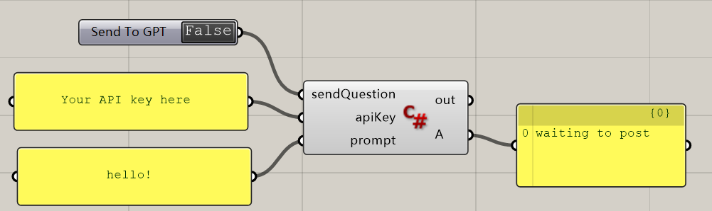

### GH-GPT

C# and python code component to use OpenAI's GPT API inside Grasshopper.

### **To use C#:**

1. Open .gh file.
2. Right click on C# component and click "Manage Assemblies".
3. Click Add and refer to Newtonsoft.Json and System.Net.Http(link below)
4. Paste your apiKey in the first panel.
5. Input your prompt in the second panel.
6. Double click on Send To GPT and your respond is there!

### To use python:

1. Open .gh file.
2. Paste your apiKey in the first panel.
3. Input your prompt in the second panel.
4. Double click on Send To GPT and your respond is there!

### Links:

**Newtonsoft.Json:** https://github.com/JamesNK/Newtonsoft.Json/releases/download/13.0.3/Json130r3.zip

**System.Net.Http:** For safety reasons, Highly recommend to use the one on your computer if you have .net frame installed. You can find it at:

C:\Windows\Microsoft.NET\Framework\v4.0.30319\System.Net.Http.dll

C:\Windows\Microsoft.NET\Framework64\v4.0.30319\System.Net.Http.dll

### Liscence: MIT

Souce Code included
